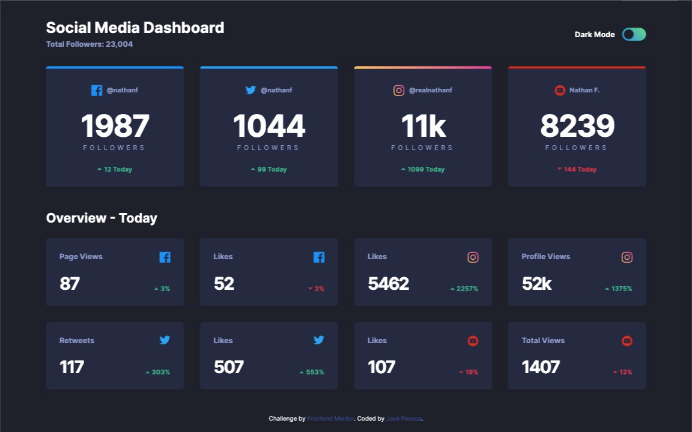
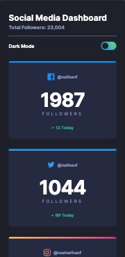
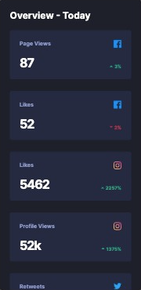

# Frontend Mentor - Social media dashboard with theme switcher solution

## Welcome! 👋

This is a solution to the [Social media dashboard with theme switcher challenge on Frontend Mentor](https://www.frontendmentor.io/challenges/social-media-dashboard-with-theme-switcher-6oY8ozp_H). Frontend Mentor challenges help you improve your coding skills by building realistic projects.

## Table of contents

- [Overview](#overview)
  - [The challenge](#the-challenge)
  - [Screenshot](#screenshot)
  - [Links](#links)
- [My process](#my-process)
  - [Built with](#built-with)
  - [Useful resources](#useful-resources)
- [Author](#author)

## Overview

### The challenge

Users should be able to:

- View the optimal layout for the site depending on their device's screen size
- See hover states for all interactive elements on the page
- Toggle color theme to their preference

Additional features:

- Display dashboard according to user's prefers-color-scheme
- Save preference to local storage in case the user prefers a mode that's different than the system

### Screenshot

Desktop

Mobile

### Links

- Solution URL: [Solution Page](https://www.frontendmentor.io/solutions/social-media-dashboard-with-dark-mode-using-scss-and-vanilla-js-LV10fz76F)
- Live Site URL: [Preview Site](https://jgbpessoa.github.io/social-media-dashboard/)

## My process

### Built with

- Semantic HTML5 markup
- CSS custom properties
- SASS/SCSS pre-processor
- Flexbox
- CSS Grid
- Mobile-first workflow
- Gulp Workflow for Optimization

### Useful resources

- [Dark Mode](https://www.ditdot.hr/en/dark-mode-website-tutorial) - This helped me understand the prefers-color-scheme media query.
- [Dark/Light Mode](https://maxpelic.com/blog/post/darkmode-example/) - Tips on how to implement it.

## Author

Coded by José Pessoa 🧪 💻

- Frontend Mentor - [@jgbpessoa](https://www.frontendmentor.io/profile/jgbpessoa)
